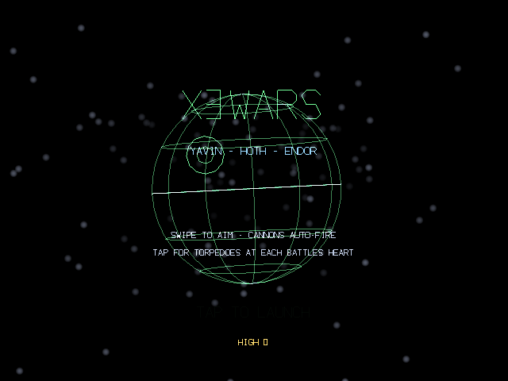
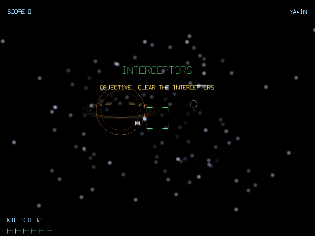

# X3Wars

A first-person **vector rail assault** for the RayNeo X3 Pro smart glasses,
in the spirit of the great 1983 color-vector arcade cabinets: glowing
wireframes on black (transparent on the waveguide), a young pilot, an old
mystic in your ear, and one impossible torpedo shot at the heart of a
moon-sized battle station.

## Screenshots

<p>
  
  
</p>

## The campaign

Three battles, cycling forever with a rising PART number and difficulty
(PART 2 YAVIN, PART 3 YAVIN, …):

**YAVIN** — interceptors in open space (their bolts are shootable), the
station surface with its cannon towers, then the trench: barriers to thread,
range counting down, the targeting computer switching itself off, and one
well-timed TAP to send the torpedoes into the exhaust port.

**HOTH** — hunt probe droids over the snowfall, hold the line against
head-shot-only armored walkers, carve through a mixed imperial screen
(gunships, hunters, interceptors) as a dagger destroyer looms closer, then
strafe its deck — radars and turrets — until it goes down.

**ENDOR** — a flat-out speeder run through the forest, threading trunks and
dodging two-legged striders, torpedo the shield generator, clear the fleet
above, then a claustrophobic duct run through the unfinished station to its
core.

Miss a torpedo window and you loop around for another pass. Every full cycle
raises the PART number: more enemies, tougher walkers, tighter gaps.

## Your soundtrack (authored in the repo)

The `music/` folder in this repo holds one workspace per scene — `title`,
`yavin_space`, `yavin_surface`, `yavin_trench`, `hoth_droids`,
`hoth_walkers`, `hoth_fleet`, `hoth_deck`, `endor_forest`, `endor_space`,
`endor_core`, `victory` — each containing **`_prompt.txt`**, a
ready-to-paste AI-music-generation prompt matched to that scene's mood and
tempo.

Workflow: paste a prompt into your generator, save the result into the same
folder as `.mp3`/`.ogg`/`.m4a`, then integrate and rebuild:

```bash
tools/integrate_music.sh     # copies tracks into app assets
./gradlew assembleDebug      # they now ship inside the APK
```

A scene with several tracks picks one at random each time; a scene with
none plays without music. (Tracks pushed to
`Android/data/com.x3wars/files/music/<scene>/` on the device override the
bundled ones — handy for quick experiments.)

## Controls (two inputs, no settings)

| Input | Action |
|---|---|
| **Swipe** (4-way) | Steer the aim reticle — in the runs it flies the ship |
| **Tap** | FIRE the cannons · torpedoes at each battle's heart · start · retry |

Suite conventions: temple tap arrives as a KEY, the left pad is ignored,
horizontal swipe sign is inverted on this hardware (forward = right).

## The voices

Two speakers, pre-generated with fish.audio S1 (no synthesis at run time —
missing clips are baked once from device TTS on first boot):

- **The pilot** — `16b68ec193c24e61929c84c1306961a5`
- **The old mystic** — `77fec8dd00174ddcac427af0b1011709`

```bash
export FISH_API_KEY=...     # never stored anywhere
python3 tools/generate_tts.py
./gradlew assembleDebug
```

## Build & install

```bash
cd ~/Projects/X3Wars
./gradlew assembleDebug && adb install -r app/build/outputs/apk/debug/app-debug.apk
```

JDK 17, AGP 8.7.3, Kotlin 2.0.21, compileSdk 35 / minSdk 29, zero
dependencies. GLES3, additive-blend line/point batches, stroke-font HUD;
side-by-side per-eye viewports auto-enable on RayNeo hardware (detected by
manufacturer identity, never `Build.MODEL`). All audio synthesized at first
launch or pre-generated — nothing network at run time, no per-frame
allocation on the render thread.
